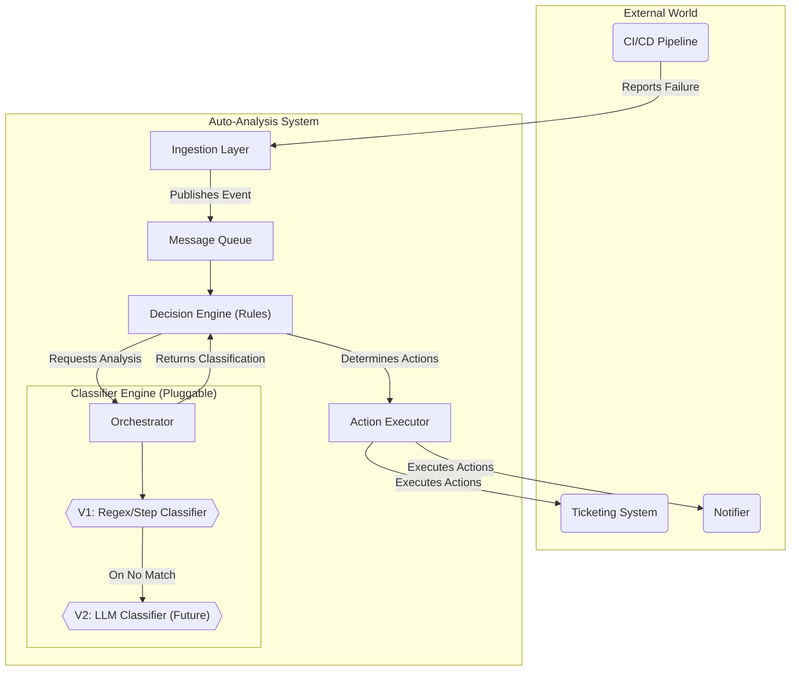

# Test Automation Auto-Analysis System

This project is a mock implementation of a sophisticated system designed to automatically analyze test automation failures. It ingests test results, classifies the root cause of failures using a pluggable engine, and determines the appropriate follow-up actions.

The primary goal is to reduce the manual effort required for triaging test failures, provide faster feedback to developers, and generate valuable insights into automation health.

## Architectural Overview

The system is designed as a modular, event-driven pipeline. This architecture ensures that components are decoupled, scalable, and can be updated independently. For example, the `Classifier Engine` can be swapped from a simple Regex-based model to a powerful LLM-based one with no impact on the rest of the system.

### Core Components

1.  **Ingestion Layer:** A dedicated API endpoint where CI/CD pipelines report test failures. It validates the incoming data (logs, metadata, artifacts) and publishes it as an event to a message queue.

2.  **Data & Context Service:** The central repository for all test-related data. It stores structured metadata (like test names, environments, and classifications) and links to large artifacts (like full logs and screenshots).

3.  **Classifier Engine (Pluggable):** The heart of the system. It analyzes the failure data to determine the root cause. This component is designed to be highly flexible:
    * **V1: Regex & Rule-Based:** The initial implementation uses fast, deterministic classifiers. This includes searching for specific error strings (e.g., "Connection timed out") and analyzing failed Ginkgo `STEP:` lines for context.
    * **V2: LLM-Based (The Evolution):** The system is designed to evolve by adding an LLM-based classifier. The flow would be:
        1.  First, try the fast Regex/Step-based classifiers.
        2.  If they fail to produce a high-confidence match, the system can **escalate the analysis** to a fine-tuned Large Language Model (LLM). This LLM would be trained on internal failure data to recognize complex and novel failure patterns that regex cannot handle.

4.  **Decision & Action Engine:** A configurable rules engine that takes the classification results and other metadata (e.g., environment type, rerun count) to decide on the appropriate actions.

5.  **Action Executor:** A set of workers that perform the actions determined by the Decision Engine, such as creating a Jira ticket, posting a Slack notification, or triggering a custom script.

### Architectural Diagram (Mermaid.js)



## Django Demo Implementation

This repository contains a fully runnable mock of the architecture using the Django web framework. It simulates the entire workflow in memory each time the dashboard is refreshed.

### Key Features of the Demo

* **Live Simulation:** Refreshing the dashboard re-runs the entire analysis pipeline with a predefined set of mock test failures.
* **Live Flow Log:** The dashboard includes a log panel that shows the step-by-step flow of the simulation, demonstrating how each component of the architecture is being used.
* **Ginkgo Step Parsing:** The system parses `STEP:` lines from logs to identify the exact point of failure, enabling more precise classification.
* **Multi-Classifier Support:** A single test failure can be matched by multiple classifiers (e.g., a Regex classifier and an LLM classifier), and the UI will display all findings.
* **Dynamic Data Extraction:** Classifiers can extract dynamic information (placeholders) from logs, such as a failed Ansible role name, and display it in the analysis details.
* **Action Execution with Results:** The simulation includes a mock `ActionExecutor` that "runs" the decided-upon actions and attaches the results (e.g., a mock script output or new Jira ticket ID) to the test run for viewing in the UI.
* **UI Pages:**
    * **Dashboard:** The main view showing the table of test failures and the live simulation log.
    * **Log Viewer:** A detailed page for each test run, showing metadata, all executed steps (with the failed step highlighted), full logs, and the results of any actions taken.
    * **Manage Page:** A simple page that lists all the Classifications and Actions currently defined in the system.

## How to Run the Demo

### Prerequisites

* Python 3.8+
* `pip` for installing packages

### Setup Instructions

1.  **Clone or Download the Project:**
    Ensure you have the `test_analysis_project` directory on your local machine.

2.  **Navigate to the Project Directory:**
    Open your terminal and change into the project's root directory.
    ```bash
    cd path/to/test_analysis_project
    ```

3.  **Create and Activate a Virtual Environment (Recommended):**
    ```bash
    # Create the virtual environment
    python -m venv env

    # Activate it
    # On macOS/Linux:
    source env/bin/activate
    # On Windows:
    # .\env\Scripts\activate
    ```

4.  **Install Dependencies:**
    Create a file named `requirements.txt` in the project root with the following content:
    ```
    django
    ```
    Then, run the installation command:
    ```bash
    pip install -r requirements.txt
    ```

5.  **Run the Web Server:**
    ```bash
    python manage.py runserver
    ```
    You should see output indicating the server has started, similar to this:
    ```
    Performing system checks...
    System check identified no issues (0 silenced).
    Starting development server at [http://127.0.0.1:8000/](http://127.0.0.1:8000/)
    Quit the server with CONTROL-C.
    ```

6.  **View the Dashboard:**
    Open your web browser and navigate to:
    [http://127.0.0.1:8000/](http://127.0.0.1:8000/)

## Future Enhancements

This demo provides a strong foundation. To evolve it into a production-ready system, the next steps would include:

* Replacing the in-memory database with a real one (e.g., PostgreSQL).
* Integrating a real message queue (e.g., RabbitMQ or Kafka).
* Building out the API integrations for Jira, Slack, and your CI/CD tool.
* Fine-tuning and deploying a real LLM for the advanced classification step.
* Adding a database-backed UI for managing classifiers and decision rules dynamically.

